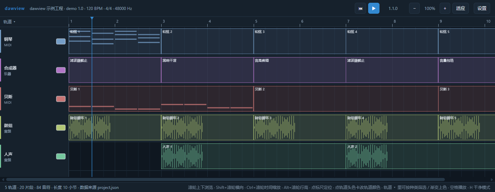
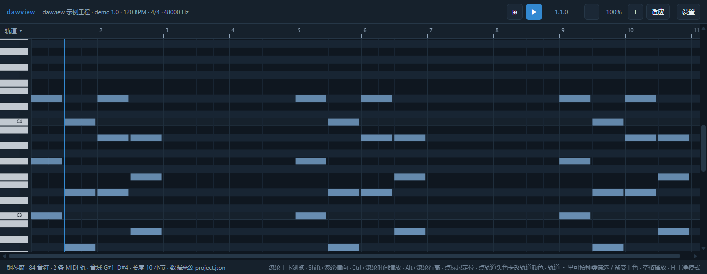
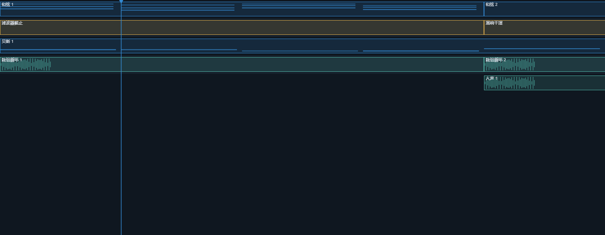
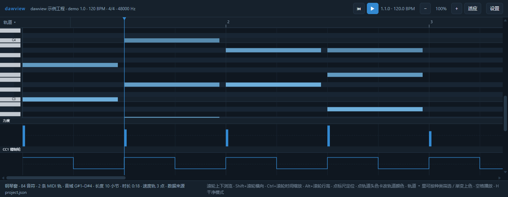

# dawview

把 DAW 工程文件解析成**可以滚动浏览的走带视图**（轨道 / 片段 / 音符 / 音频波形位置），
用来录制走带演示。**不解析音频**，只做时间线可视化。



纯 Python 解析（只用标准库）+ 原生 JS 前端（无构建、无 npm）。
**零第三方依赖**：解析器和本地 HTTP 服务都只用标准库，窗口用系统自带的 Edge/Chrome 的
app 模式打开 —— 只需要 Python 本身，不用 `pip install` 任何东西。

当前支持：

| 宿主 | 扩展名 | 实测版本 | 解析器 |
|---|---|---|---|
| Cubase | `.cpr` | 15.0.30 WIN64 | `dawview/cpr_parser.py` |
| FL Studio | `.flp` | 25.2.4.5242 | `dawview/flp_parser.py` |
| — | `.json` | — | 已经是 dawview 契约 JSON 就直接打开（内置示例走这条） |

两种格式都是**实证逆向**出来的，线格式笔记写在各自解析器的 docstring 里
（字段偏移、事件 ID、踩过的坑）。加新宿主只要在 `dawview/app.py` 的 `PARSERS`
注册表里登记一个"路径 → 契约字典"的函数。

## 快速开始

### 环境

- Python 3.10+（代码里用了 `X | Y` 类型标注；实测 3.11）
- 浏览器：Windows 10/11 自带 Edge，直接可用；万一没有 Edge/Chrome 会退回系统默认浏览器（有地址栏）
- **没有第三方包要装**，`pip install` 这一步不存在

想连 Python 都不装：把 python.org 的 `python-3.11.x-embed-amd64.zip` 解压到 `python-embed/`
（仓库根目录），`run.bat` 会优先用它 —— 这就是便携包的路子（`python-embed/` 不入库）。

### 跑起来

| 方式 | 命令 |
|---|---|
| Windows 双击 | `run.bat`（默认打开内置示例；想固定打开自己的工程，把路径写进 `default-project.txt`） |
| 拖放 | 把 `.cpr` / `.flp` 拖到 `run.bat` 上 |
| 命令行 | `python -m dawview "路径/工程.flp"` |
| 先看看长什么样（不用自己的工程） | `python -m dawview docs/demo-project.json` |
| 只看解析结果、不起服务 | 加 `--dev`（会写出 `web/project.json`） |
| 不起窗口、只起服务（给 OBS / 外部浏览器） | 加 `--no-window`（会打印服务地址） |
| 页面关掉后服务也留着 | 加 `--keep-open`（Ctrl+C 结束） |
| 指定外观设置的落盘位置 | 加 `--prefs 路径`（默认 `web/prefs.json`；`--prefs none` 就只在内存里同步） |

窗口关掉时程序自动退出（不留后台进程）；**OBS 的浏览器源连着时不算关**（全关才退）。

### 用 OBS 浏览器源录制

整套流程（拖工程 → 浏览器源 → 录制）：

1. **打开 dawview**：把工程文件（`.cpr` / `.flp`）拖到 `run.bat` 上。dawview 窗口打开，
   同时留着一个命令行窗口，里面打印着 OBS 要填的地址：

   ```
   [dawview] 服务已启动：http://localhost:8973/index.html
   [dawview] OBS 浏览器源填这个地址（外观 / 操作都跟着 app 窗口走）：http://localhost:8973/index.html
   ```

   （双击 `run.bat` 则是打开内置示例；想固定打开某个工程就写进 `default-project.txt`。）
2. **在 OBS 里加「浏览器」源**：URL 填上面那行地址 `http://localhost:8973/index.html`，
   宽高按你要的画面设（比如 1920×1080）。
   - 填**不带** `?role=host` 的那行 —— `?role=host` 是 dawview 窗口专用的"设置以我为准"
     标记，浏览器源带上会跟主窗口抢设置。
   - 只是给 OBS 当画面、不想要 dawview 窗口时，加 `--no-window` 起服务
     （`python -m dawview "工程.flp" --no-window`）。
3. **在 dawview 窗口里调画面**：主题、轨道配色、缩放（Ctrl+滚轮）、行高、走带还是钢琴窗、
   要不要干净模式（隐藏顶栏/轨道头/状态栏）或导出模式（隐藏网格线/标尺/滚动条）。
   OBS 那个画面会跟着一起变，不用在 OBS 里再调一遍。
4. **操作也在 dawview 窗口里做**：空格播放/暂停、点标尺定位 —— OBS 画面跟着走。
   （浏览器源吃不到键鼠，中继就是补这个的：录制时不需要切到那个源上去操作。）
5. **在 OBS 里开始录制**。dawview 页面不发声，要带配乐就在 OBS 里另加音频源。

端口固定是 `8973`，所以 OBS 里配一次就一直能用；`--keep-open` 可以让 OBS 短暂重连时
不把服务带走。关掉 dawview 窗口时如果 OBS 那个源还连着，服务会等它一起收工。

**浏览器源和 dawview 窗口是联动的**（浏览器源是 OBS 自己一套浏览器实例，`localStorage`
不通用，所以走服务端中转）：

| 你要的效果 | 怎么发生的 |
|---|---|
| 浏览器源的外观自动和 dawview 窗口一样（主题 / 显示选项 / 轨道配色 / 缩放） | 设置存在服务端一份共享副本（`/prefs`，同时落盘到 `web/prefs.json`）。dawview 窗口（地址带 `?role=host`）以它自己的设置为准并推上去；浏览器源启动时拉下来，运行中收到广播就跟着改 |
| 在 dawview 窗口里操作，OBS 那个画面跟着播（键盘不用切到浏览器源上） | 操作走 `/control` 中继：播放/暂停、定位、缩放、行高、视图切换、干净/导出模式、轨道显示隐藏都会广播给其它窗口执行 |
| 播放中两边画面不飘 | 最近被操作的那个窗口当"时钟主"，每 250ms 报一次位置，别的窗口差到约 12px 才纠正一次 |
| 用按键 / 外部工具驱动（甚至不用窗口） | `curl -d '{"action":"toggleplay"}' http://localhost:8973/control`；动作白名单在 `dawview/server.py` 的 `CONTROL_ACTIONS` |

顺带：录制时最常用的几个键 —— 空格 播放/暂停、`H` 干净模式、`E` 导出模式、
`M` 走带↔钢琴窗、`,` 打开设置菜单（主题 / 配色 / 显示开关都在里面）。完整清单见下面「操作」一节。

## 能看什么



- **走带视图**：轨道 / 片段 / 音符 / 标尺 / 网格，横纵滚动、时间缩放、行高缩放
- **MIDI 钢琴窗**：全部 128 个琴键，音高 × 时间，进视图自动滚到音符所在音区
- **播放走带**：播放头扫过时音符提亮发光、片段入点亮起、播放头拖尾（全部可单独关）
- **变速播放**：按工程的速度轨逐段变速走带（Cubase 速度轨 / FL 速度自动化曲线），不是整首一个 BPM
- **力度 / CC 曲线栏**：钢琴窗下部可加多栏看力度或任意 CC 曲线，栏高可调（**默认一栏都不显示**）
- **12 套明暗主题**：对比度有硬门槛，验证脚本逐套核对
- **配色**：每条轨道单独配色（12 色卡 / 自定义取色 / 批量渐变），按工程分开记
- **轨道选择器**：显示隐藏、按种类快筛（MIDI / 音频 / 自动化 / 乐器 / 其他）、渐变上色
- **干净模式**：一键隐藏顶栏 + 轨道头 + 状态栏，只剩内容，方便录屏
- **导出模式**：一键隐藏背景格线 + 上方标尺 + 滚动条，导出干净的底图做叠层编辑（和干净模式可叠加）



## 操作

| 操作 | 效果 |
|---|---|
| 滚轮 | 上下浏览轨道 |
| Shift+滚轮 / 拖动底部滚动条 | 横向滚动时间线 |
| Ctrl+滚轮 | 时间缩放（锚定鼠标位置） |
| Alt+滚轮 | 行高缩放（走带改轨道高，钢琴窗改半音行高） |
| 点标尺 / 点时间线 | 定位播放头 |
| **点轨道头右侧的色卡** | 给这条轨道单独配色（右键色卡 = 恢复默认色） |
| 空格 | 开始 / 暂停走带播放 |
| **H** / Esc | **干净模式**：一键隐藏顶栏 + 轨道头 + 状态栏（Esc 只退出，H 切换） |
| **E** | **导出模式**：一键隐藏背景格线 / 上方标尺 / 滚动条（叠层编辑用；可与干净模式叠加） |
| **,** | 打开 / 关闭设置菜单（「控制器」里加力度 / CC 曲线栏） |
| **T** / 点左上角「轨道 ▾」 | 轨道选择器（见下） |
| 顶栏 ▶ / ⟲ | 播放 / 暂停、回到开头 |
| 顶栏 −／+／适应 | 缩放 / 适应窗口宽度 |
| 顶栏「设置」 | 二级设置菜单（见下） |

### 设置菜单（二级）

点顶栏「设置」（或按 `,`）打开：左边是分组，右边是该组的选项。

| 分组 | 选项 |
|---|---|
| 显示 | 干净模式、导出模式、片段上显示名称、轨道头 / 钢琴键栏、走带行高、钢琴窗半音行高 |
| 视图 | 视图模式（走带 / **钢琴窗**）、播放跟随（翻页 / 居中） |
| 播放 | 播放速度（0.5x / 1x / 1.5x / 2x） |
| 动效 | 启用播放动效、音符闪光、片段入点光晕、播放头拖尾、强度、余韵 |
| 配色 | 主题（深色 7 套 / 浅色 5 套）、主色 |

### 轨道选择器：显示/隐藏 · 按种类快筛 · 渐变上色

左上角「轨道 ▾」（或按 `T`）打开。勾掉的轨道**走带不画这一行、钢琴窗也不画这一轨的音符**，
一处生效两处都变；面板顶部有「显示 N / N 条轨道」和「全选 / 全不选」，状态栏会标出隐藏了几条。
每行前面的小色点就是这条轨道当前的颜色（半透明 = 还没自定，跟主题默认色）。

- **按种类快筛**：面板顶部一排胶囊 `全部 / MIDI / 音频 / 自动化 / 乐器 / 其他 ……`
  （只列出这个工程里真有的种类，后面跟条数）。点一下只留这一类，再点「全部」回到全显示。
  它走的是同一套隐藏机制，所以钢琴窗、状态栏、记住的显示状态都跟着变；
  手动勾/取消勾会自动取消胶囊的选中态。
- **渐变上色**：面板底部一排按钮，给**当前显示的轨道**按从上到下的顺序排一条渐变（见下）。

轨道栏被关掉（干净模式或设置里关掉轨道头）时选择器自动收起。

### 轨道颜色

轨道头右侧有个色卡按钮（画布上画的小方块）：**点它**弹出选择器 ——
12 个预设色卡 + 「自定义」原生取色器 + 「默认」按钮；选了立刻生效，
**右键色卡**等于一键恢复默认。选中的颜色会用在：这条轨道头的色条与色卡、
走带里它的片段（底色 / 边框 / 波形柱）与片段内音符、钢琴窗里这一轨的音符。

颜色按工程分开记在 `localStorage`（`dawview.trackColors`，键是工程名 + 轨道序号），
换工程不串色，也不进数据契约、不回传后端。

**批量渐变上色**：轨道选择器底部一排「渐变上色」按钮，给当前显示的轨道排一条渐变 ——

| 按钮 | 效果 |
|---|---|
| 色卡 | 沿 12 色卡调色板走：按色相排序后插值（照原顺序插会跳色），饱和度压到 0.5 以内 |
| RGB | 色相环扫 300°（不用整圈：首尾太像就白分了），深色主题 S 0.42 / L 0.62，浅色主题 S 0.34 / L 0.42 |
| 清除 | 清掉这些轨道的自定色，恢复跟随主题 |

两档都是低饱和 + 明度跟着主题明暗走（跟 12 套主题同一条路线）：轨道色是背景信息，
不该比片段本身抢眼。先按种类筛出 MIDI 轨再点「RGB」，就是"只给 MIDI 轨上一条渐变"。

### 配色主题

设置 → 配色 → 主题，下拉框按「深色 / 浅色」分成两组，一共 12 套：

- 深色：水蓝、深夜、深海、霓虹、苔原、落日、摩卡
- 浅色：晨雾、象牙、薄荷、樱花、青灰

一套主题就是一组 CSS 变量（底 / 面板 / 边线 / 网格 / 正文 / 次要文字 / 主色 /
三种片段色 / 音符色），**画布也从这些变量取色**，所以换主题是全站生效
（走带、钢琴窗、轨道头、菜单、状态栏一起变）。「主色」可以单独覆盖主题里的主色。
主题存 `localStorage`（`dawview.theme`），下次打开还是它。

加新主题只改 `web/theme.js`：照着已有条目复制一份、写 `kind`（`'dark'` / `'light'`）、
`label` 和 13 个变量就行，菜单分组会自动跟上。硬要求写在文件头的注释里
（正文/底 ≥ 10:1、次要文字/底 ≥ 3.5:1、主色/底 ≥ 3:1、音符/底 ≥ 4:1……），
`scripts/verify.mjs` 会逐套核对：变量齐全、页面上的值跟主题定义一致、对比度达标、
深浅标记跟底色亮度对得上、**三种片段色两两分得开**、12 套主题在画布上真的画出 12 种不同的颜色。

### MIDI 钢琴窗视图

设置 → 视图 → 视图模式选「钢琴窗」：只画工程里的 MIDI 音符，横轴是时间、纵轴是音高，
左侧钢琴键栏标音名（C4 = 中央 C），**纵向是全部 128 个琴键**（含工程 MIDI 范围之外的，
靠滚动看）—— 进视图时会自动把视野滚到音符所在的音区，不会一进来对着空白。
轨道多时按轨道在 note 色和主色之间取中间色区分。音符滚出左边界就被裁掉，不会"顶"在键栏边上。

### 力度 / CC 曲线栏（钢琴窗下部）



设置 → 控制器：勾「力度栏」加一条力度柱状栏；「CC 曲线栏」可以加多栏，每栏一个下拉选
这个工程实际有的 CC（下拉里直接标了 CC 号和点数，没数据的工程是空的）。栏高可调，
栏名写在每栏左上角。**默认一栏都不显示**，不需要就当它不存在。

- 力度柱高 = `notes[].velocity / 127`；CC 画成**阶梯折线**（MIDI 的 CC 是保持值不是斜坡，
  踏板 0/127 这样画最清楚），中线是 64 便于读图。
- 栏跟着横向滚动 / 缩放一起动，播放头从栏上穿过去；音符区自动让出栏占的高度。
- 这几栏是**纯前端显示偏好**（有几栏、每栏看哪个 CC、栏高），只存 `localStorage` 的
  `dawview.view`，不进数据契约、不回传后端。
- FL 工程没有 MIDI CC（FL 把自动化存在自动化通道里，不在音符事件流里），那份工程 CC 栏
  是空的；力度照常有。

### 变速播放

走带播放跟着**速度轨**走：一首里速度变几百次，播放头的推进速率就跟着变几百次。
顶栏走带标签会显示当前位置的速度（`小节.拍.tick · 速度 BPM`）。

- **Cubase**：解析 `MTempoTrackEvent` 区块里的速度记录（`dawview/cpr_parser.py`）。
  实测那份工程 1129 条 22 字节记录 → 1127 个变速点，**阶梯语义**：每段用段首速度保持到
  下一个点（实测相邻点的实际间隔恒等于前一点的"每四分音符秒数"，不是线性插值）。
- **FL**：工程速度事件（`ID 156`，值 = BPM × 1000）+ **Tempo 自动化曲线**（内部控制器
  通道 `ID 234` 的包络，按播放列表里该通道的片段定位），曲线值按 `BPM = 60 + 120 × value`
  还原，再按 1/16 拍加密成台阶 —— 实测 149 点曲线 → 897 个台阶点，曲线常驻值 0.625 正好
  = 135.000 BPM = 工程速度，两边对得上。
- 契约里的 `tempoMap` 就是 `[[tick, bpm], ...]`，前端自己积分钟数（`buildTempo`）；
  没有速度轨的工程退化成一个点（按 `meta.bpm` 定速），行为跟以前完全一样。

### 播放动效

播放时播放头扫过的内容会亮一下：音符提亮 + 外发光 + 一圈光点晕，
片段入点整块亮起并有一道流光，播放头后面拖一段矩形渐隐拖尾。
全部可在「设置 → 动效」里单独开关，强度分柔和 / 标准 / 强烈，余韵决定拖尾长度。

播放头这一层**只画在时间线内容区**（左侧轨道头 / 钢琴键栏之外）：拖尾向左延伸时会被裁掉，
不会盖到轨道头上 —— 不开干净模式也干净。

显示选项（干净模式、导出模式、片段名、跟随方式、行高、视图模式、动效、速度、缩放）都会记住，下次打开还是这个样子 —— 前提是服务端口没变：窗口每次用固定端口 8973 启动（`DAWVIEW_PORT` 可覆盖），因为浏览器把 `localStorage` 按"协议+主机+端口"隔离，端口一变设置就全读不回来。端口被别的程序占用时会退回随机端口并明确提示（那次启动的设置不会记住）。

## 宿主差异：FL Studio（.flp）

`.flp` 是二进制事件流（`FLhd` + `FLdt`），解析器在 `dawview/flp_parser.py`。
实测工程（12 MB / 15971 个事件）解析结果：FL Studio 25.2.4.5242 / 173.0 BPM / 4/4 / ppq 96 /
167 轨道 / 3274 片段（音频 1755、**自动化 1418**、模式 101）/ 3248 音符
（模式片段只算"片段真正播的那一段"，见下）。

四个 FL 特有的地方：

- **播放列表记录长度随版本变**（FL 25 = 80 字节，FL 24.1 = 60 字节，老版本 32）。
  解析器不硬编码，而是按"记录自洽"给每种长度打分（`@2` 恒为 `0x5000`、长度/位置/轨道号
  都像话的比例）取最像的那个 —— 硬编码 80 会把 24.1 的工程读成一堆垃圾记录。
- **模式片段带裁剪区间**。记录 `@24` 的 u32 是"播模式里的哪一段"（区间长度恒等于片段长度）：
  同一个模式被切成两段放在播放列表里时，音符要按区间裁掉再左移，否则两段会各画一遍全部音符。
  （实测那份 FL 25 工程 67/101 个模式片段带裁剪，音符数因此从 3591 变成 3248。）
- **速度**：FL 25 的老工程里根本没有速度事件（156/66/93 都不存在），只能反推 ——
  音频片段的 `end_offset`（源文件时长，毫秒）除以片段长度（tick）就是每 tick 毫秒数，
  取众数再优先整数速度 → 173.000 BPM（557 个片段一致；其余小簇是采样包自己的速度）。
  FL 24+ 的工程里有 `ID 156`（值 = BPM × 1000）和 Tempo 自动化曲线（`ID 234`），
  这时速度轨就是真的（见「变速播放」）。
- **自动化片段单列一类**。FL 的自动化片段挂在"插件参数通道"上（类型 5），
  数量能占全工程四成 —— 当成 MIDI 画会全是空块。它们现在有独立的片段种类
  `automation`、独立的主题色 `--clip-auto`、轨道标签「自动化」，**不画假波形**
  （那 40 根柱子是给音频片段画装饰的，画到自动化上就是编的）。
- **轨道固定写满 500 条**，没名字又没片段的直接不输出（否则界面是 500 行空轨道）。

## 数据契约

后端解析 → 契约 JSON → 由本地 HTTP 服务（`dawview/server.py`）发给前端；同一份 JSON 也写进
`web/project.json`，这样不起服务、直接开页面也能看（无头验证走的就是这条路）。契约是**两端唯一接口**，写在 [`docs/01-data-contract.md`](docs/01-data-contract.md)：
顶层 `meta / tempoMap / markers / tracks / lengthTicks`，轨道有 `kind`，
片段有 `kind`（`midi` / `audio` / `automation` / `other`）、`notes`（含 `velocity`）和
`controllers`（`{cc, name, points: [[tick, value], ...]}`，tick 相对片段起点，跟 `Note.startTick` 一样）。
`tempoMap` 是 `[[tick, bpm], ...]` 的**阶梯**速度轨（首点必在 tick 0；单点 = 定速）。

铁律：tick 是唯一时间单位；`startTick` 绝对时间（`Note.startTick` 相对片段）；
解析失败不崩溃（单轨/单片段跳过并记 warning）。

**显示选项不进契约**：主题、颜色、隐藏了哪些轨道、行高、动效……只存 `localStorage`
（`dawview.theme` / `dawview.view` / `dawview.trackColors`），不回传后端。
契约只描述"工程长什么样"，显示方式由使用者自己定。

## 项目结构

```
dawview/          纯 Python 后端
  cpr_parser.py   Cubase .cpr 解析器（实证逆向，含格式注释）
  flp_parser.py   FL Studio .flp 解析器（事件流 + 播放列表记录，80/60/32 字节自适应）
  model.py        宿主无关数据模型
  server.py       本地 HTTP 服务（静态文件 + /project.json + /events 长连接，纯标准库）
  app.py          入口：解析 → 起本地服务 → 开窗口（PARSERS 按扩展名分发）
web/              前端（原生 JS，无构建）
  timeline.js     Canvas 绘制（走带 / 钢琴窗）
  app.js          状态、交互、轨道配色、主题切换
  theme.js        12 套主题定义
docs/
  01-data-contract.md   前后端唯一接口（改契约必须两端同步）
  demo-project.json     手写的合成示例工程（README 截图 / run.bat 默认打开）
tests/            pytest（48 项：Cubase 6 + FL 10 + 速度轨/力度/CC 16 + 本地服务 16）
scripts/
  verify.mjs       前端 CDP 验证（37 + 10 + 5 项，见下）
  fx-probe.mjs     动效可见度量化（像素级差分）
  make-demo.py     重新生成 docs/demo-project.json
  make-fixture.py  从你的工程裁一份验证快照（快照不入库，见下）
  smoke_window.py  冒烟测试：真窗口能不能打开（起服务 + 拉窗口，打印地址）
run.bat            Windows 启动器
```

## 验证

```bash
python -m pytest tests/ -q                       # 73 项（Cubase 6 + FL 10 + 速度轨/力度/CC 16 + 本地服务/多窗口 41）

# 前端验证：需要一个静态服务 + 一个带 CDP 的浏览器
python -m http.server 8765 --bind 127.0.0.1 --directory web &
"C:\Program Files (x86)\Microsoft\Edge\Application\msedge.exe" \
  --headless=new --remote-debugging-port=9223 \
  --user-data-dir=$LOCALAPPDATA/Temp/edge-cdp-dawview &
node scripts/verify.mjs                          # 前端 53 项（Cubase 快照），ALL CHECKS PASSED
node scripts/fx-probe.mjs                        # 动效可见度量化（像素级差分）
```

多窗口联动（app 窗口 + OBS 浏览器源）单独一个端到端脚本，它**自带服务、自带两个浏览器
实例**（各自的 `user-data-dir`，`localStorage` 不通用才算数），跑完自己收摊，不用先起东西：

```bash
node scripts/relay-verify.mjs                    # 35 项：设置共享 / 操作中继 / 播放位置校准
node scripts/relay-verify.mjs "工程.flp"          # 换份工程跑
node scripts/relay-verify.mjs --python py        # 指定解释器（默认 python）
```

它用一个**临时**的 `--prefs` 文件，不碰你 `web/prefs.json` 里的真实设置。

`verify.mjs` 用的数据快照**不进仓库**（里面有真实工程的工程名和轨道名）。
自己生成一份，文件名固定：

```bash
python scripts/make-fixture.py "我的工程.cpr"     # -> scripts/fixture-project.json
python scripts/make-fixture.py "我的工程.flp"     # -> scripts/fixture-project-fl.json

# 变速那 5 项要一份"真的在变速"的工程快照（.cpr/.flp 都行），单独一个开关：
python scripts/make-fixture.py "变速工程.cpr" --out scripts/fixture-project-tempo.json
node scripts/verify.mjs --tempo-fixture scripts/fixture-project-tempo.json
```

没有快照时脚本会跳过对应那一段并明确说"什么都没验证"，不会满屏假 FAIL。

几个设计上的坑，写在代码注释里也写在这里：

- 验证脚本会**关掉浏览器缓存**（`Network.setCacheDisabled`）—— 改了 `web/*.js` 不关缓存会测到旧文件。
- 断言用**真鼠标/键盘事件**（CDP `Input.dispatchMouseEvent`）：synthetic `dispatchEvent`
  只证明"handler 绑上了"，证明不了"真的点得到"（画布上盖了别的东西时照样绿）。
- 新增绘制类断言都做过**反向验证**：把修复临时改回旧写法（色卡不减滚动量、去掉内容区裁剪），
  对应检查必须 FAIL；改回来全绿才算数 —— 否则断言可能只是"跟着实现一起错"
  （第一版滚动断言就是从被测函数反推期望位置，反向验证时居然 PASS）。
- 像素断言里半透明底色要跟**混出来的颜色**比（`0.84*底 + 0.16*片段色`），
  拿原色比会得出相反的结论。
- 跑完 Cubase 那 37 项后，脚本会换上 FL 快照重载页面再跑 10 项（宿主/速度/采样率、
  种类计数、自动化片段平涂、音频波形还在、ppq=96 标尺，以及滚动/快筛/渐变那几项）；
  有速度轨快照的话再换一次跑 5 项（速度轨解析、`secAt`/`tickAtSec` 自洽、**变速播放**、
  走带标签速度读数、CC 栏绘制）。其中两项滚动断言把视口压到 1400×320 才滚得动，测完复原。
- 变速播放那一项是这么测的：在速度轨里挑一段最快的和一段最慢的，各手动喂 30 帧
  （16.7ms 一帧，不依赖真实 rAF），比较两段的 tick 推进量之比 ≈ 两段 BPM 之比
  （实测 1.381 vs 1.381）。整首套一个旧速度的实现会在这里露馅。
- 涉及缩放的断言要**先把 `pxPerTick` 钉住**再测。导出模式那条本来读的是"滚动条被藏掉多少像素"，
  跑的时候缩放到"内容正好装得下"就没有滚动条可藏，断言读到的 0 跟实现好坏无关（实测踩过，
  加了 `body` / `pxPerTick` / `scrollWidth` 这些字段进 detail 才看出来）。
- 截图产物：`.cache/shots/shot-*.png`（可用 `--shot-dir <目录>` 改到别处）。

本地服务本身（路由、`/project.json`、`/prefs` 共享设置、`/control` 中继、SSE 客户端计数、
关窗判定、请求体上限、`../` 越界访问）由 `tests/test_server.py` 覆盖，不需要浏览器；
两个窗口真的联不联得上由 `scripts/relay-verify.mjs` 覆盖，也不用你先起东西。
想确认这台机器上真窗口能起来，跑 `python scripts/smoke_window.py "工程.cpr"` 冒烟。

## 已知限制（如实写）

- **不解析音频**：只画波形位置/装饰，不放声音、不做真实波形。
- **FL 速度是反推的**：工程里没存速度；采样率文件里也没有，只能默认 44100 并写进 `warnings`。
- **FL 时间标记位置只取那个 u32 的低 16 位**（实测 `0x08000300` → 768），不保证对所有工程都对。
- **解析器是实证逆向**：只在 Cubase 15.0.30 WIN64 与 FL Studio 25.2.4.5242 上验证过，
  换版本可能失效（失败会给出 warning 而不是崩）。
- **只在 Windows 上实测过**：Edge/Chrome app 模式开窗口那条路。解析、服务、前端本身
  是跨平台的，但没在别的系统上跑过 —— 非 Windows 上找不到 Edge/Chrome 的安装路径时
  会退回系统默认浏览器（有地址栏）。
- 自动化**曲线**没画（契约里预留了 `AutomationTrack`，本期只渲染色块）。
- **力度 / CC 栏只读不能改**：这是查看器，改音符/CC 值不在范围内。
- **Cubase 多轨归属靠"名字记录"**：音符和 CC 按"离哪条轨道的名字记录最近"归属。
  多轨工程里显示为空的轨道，多半是混响 / 编组 / 总线轨（工程里本来就没有 MIDI），
  不是解析漏了 —— 可对照 Cubase 里同一条轨有没有 MIDI 片段。
  实测那个 63 MB 交响工程里约 30 MB 是高熵区（不是 zlib，解不出来），
  如果某工程把 MIDI 存在这种块里，就会解析不到（给 warning，不崩）。
- **FL 的 Tempo 自动化曲线按线性插值加密**（忽略 FL 曲线的 tension/张力参数），
  台阶密度是 1/16 拍；极端张力曲线会有肉眼不可见的偏差。
- **多窗口联动的精度在窗口被降频时退化**：位置校准挂在 rAF 上，窗口最小化 / 被判定不可见时
  浏览器会把它降频（降多少没逐档量过），报位置就稀了。OBS 浏览器源是 OBS 按自己的帧率刷新的，
  画面本身照常，只是位置纠正的节奏跟着变慢。
- **联动不跨机器**：服务只绑 `127.0.0.1`，同一台机器上的浏览器才能连上。

## 致谢

- FLP 格式参考了 [PyFLP](https://github.com/demberto/PyFLP) 的源码（只当资料读，没有依赖它）
- 窗口是 Edge/Chrome 的 app 模式（`--app=`），本地服务用标准库 `http.server`
- 早期版本用 [webui2](https://pypi.org/project/webui2/) 开窗口，现已去掉：它提供的是
  「静态服务 + 一个 JS 桥」，而那个桥只在页面启动时用一次，数据本来就有文件回退这条路
